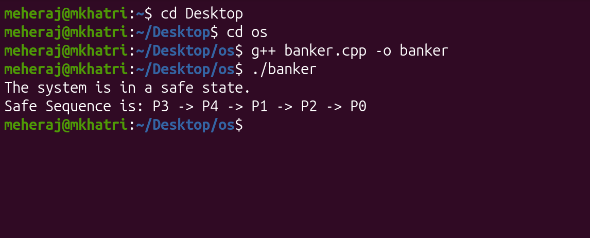

# Banker's Algorithm Project

## Program Description

This program implements the Banker's Algorithm (Deadlock Avoidance) in C++. It reads a snapshot of a system (processes and resources) from a file and determines if the system is in a "Safe State."

**How it works:**

1. **Input:** The program reads the `Allocation`, `Max`, and `Available` matrices from `input.txt`.

2. **Calculation:** It computes the `Need` matrix for each process using the formula: `Need = Max - Allocation`.

3. **Safety Check:** - It iterates through the processes to find one whose `Need` is less than or equal to the currently `Available` resources (Work).

   - If found, the process is assumed to execute, finish, and release its allocated resources back to the pool.
   - This process repeats until all processes are marked as finished (Safe) or no process can execute (Unsafe).

**Assignment Conclusion:**

Based on the provided snapshot, **Yes**, the system is in a safe state. The calculated safe sequence is shown in the results below.

## Usage Instructions

### 1. Requirements

- Linux/Unix Operating System
- G++ Compiler

### 2. Compilation

To compile the source code, open a terminal in the project directory and run:

    g++ banker.cpp -o banker

### Execution

Ensure that input.txt is present in the same directory, then run:

    ./banker

### 4. Input File Format

The input.txt file uses the following structure:

- Line 1: Number of Processes

- Line 2: Number of Resources

- Line 3: Available Resources

- Next 5 Lines: Allocation Matrix

- Next 5 Lines: Max Matrix

### Example Results

Terminal Output: 

